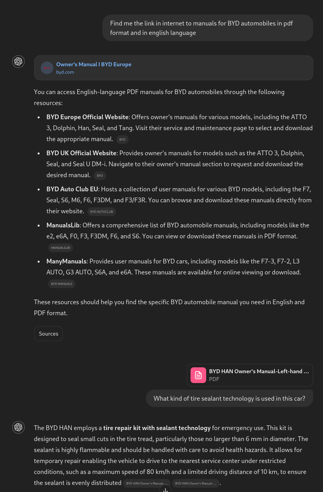
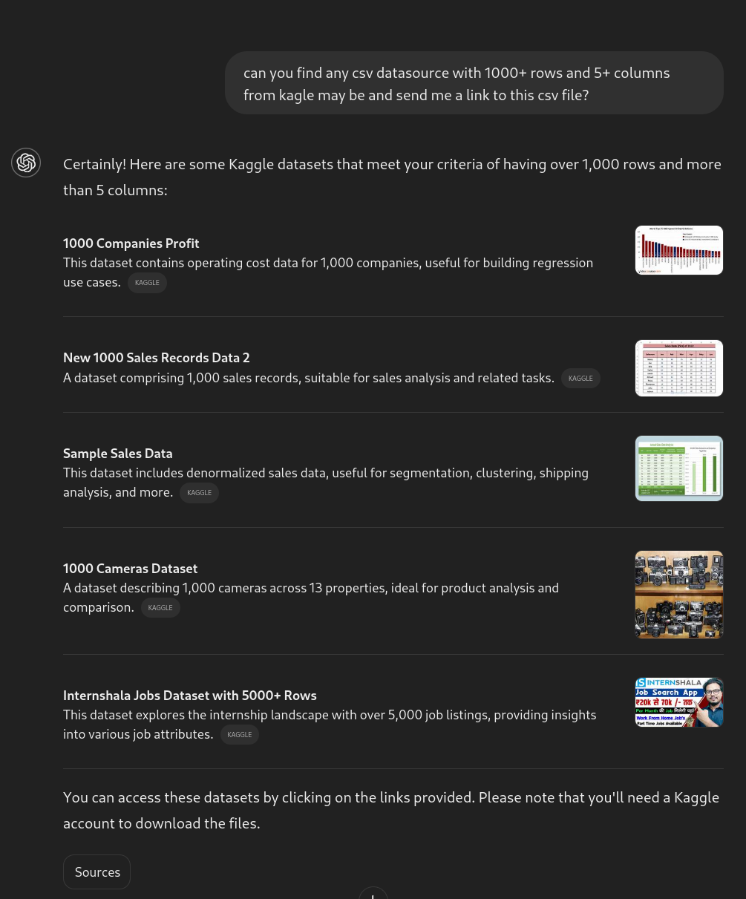
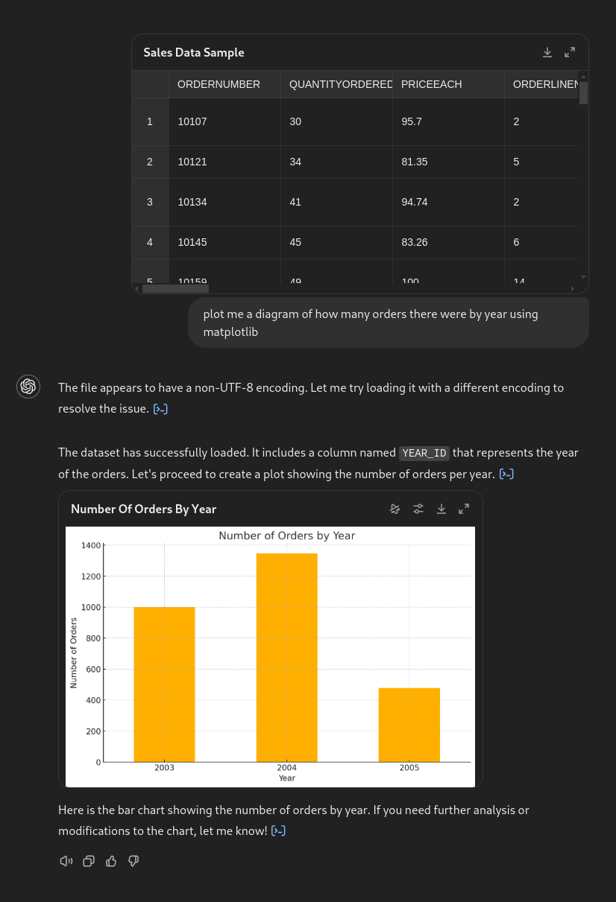

# Chat with Data

## Part 1

### Data Source
Link to the datasource: [BYD HAN Owner's Manual (PDF, English)](https://www.byd.com/content/dam/byd-site/eu/support/service/manual/%E7%94%A8%E6%88%B7%E6%89%8B%E5%86%8C-%E4%BF%9D%E5%85%BB%E3%80%81%E5%BA%A7%E6%A4%85%E5%B7%B2%E6%9B%B4%E6%96%B0241010/BYD%20HAN%20Owner's%20Manual-Left-hand%20Drive-EN-240902.pdf)

### Prompts Used
1. **Prompt:** Find me the link in internet to manuals for BYD automobiles in pdf format and in English language.
2. **Prompt:** What kind of tire sealant technology is used in this car?

### Screenshots of the Result
Below is a screenshot of the results obtained from the prompts:

---

## Part 2

### Data Source
Link to the datasource: [Sample Sales Data from Kaggle](https://www.kaggle.com/datasets/kyanyoga/sample-sales-data?resource=download)

### Prompts Used
1. **Prompt:** Can you find any csv datasource with 1000+ rows and 5+ columns from Kaggle maybe and send me a link to this csv file?
2. **Prompt:** Plot me a diagram of how many orders there were by year using matplotlib.

### Screenshots of the Result
1. **Initial Dataset and Response:**
   

2. **Plotted Diagram of Orders by Year:**
   

---
