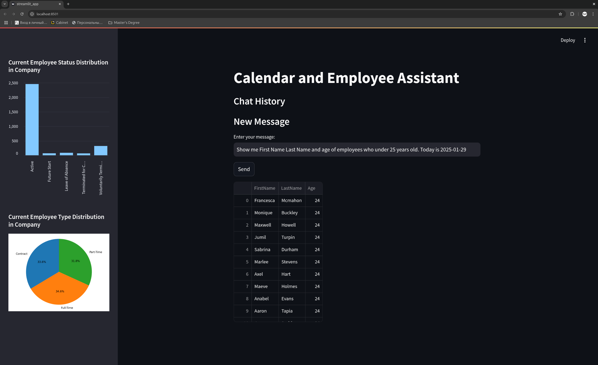
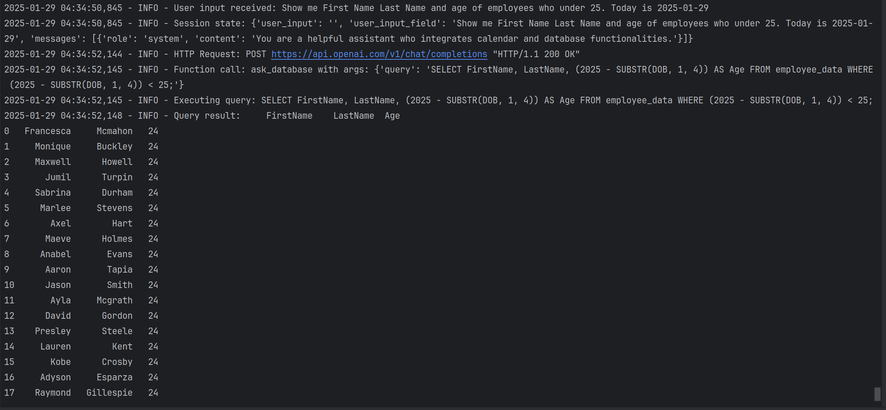
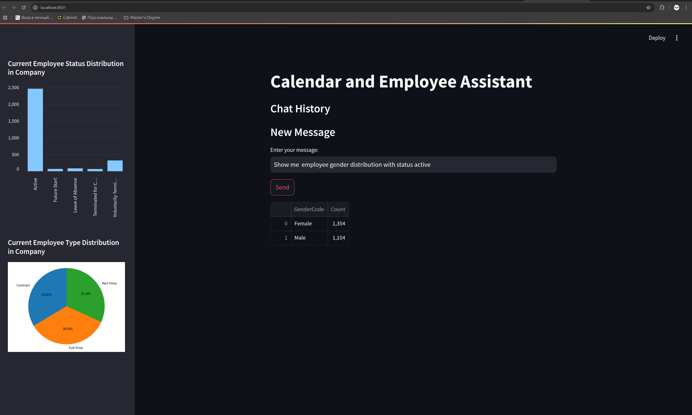
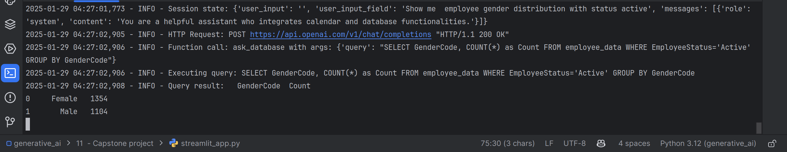
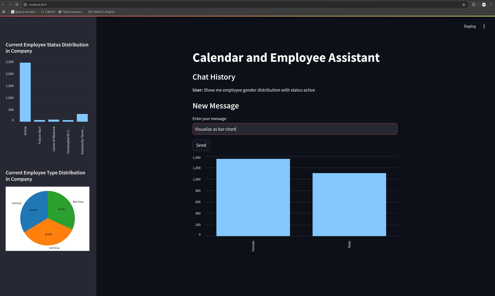

# Calendar and Employee Assistant

## Overview

The **Calendar and Employee Assistant** is a Python-based Streamlit application that integrates **Google Calendar**, **SQLite database**, and **OpenAI GPT**. It enables users to **schedule events**, **retrieve calendar events**, **query employee data**, and **visualize insights** through a conversational AI interface.

## Usage Examples

### Example 1: 



### Example 2:




### Example 3: Scheduling a Meeting
Requesting the assistant to schedule a meeting directly in Google Calendar.
But there are no screenshots for this example because of invalid emails in this [Synthetic Employee Records Dataset](https://www.kaggle.com/datasets/ravindrasinghrana/employeedataset?utm_source=chatgpt.com) from Kaggle.

---

## Features

✅ **Google Calendar Integration**: Create, modify, and fetch events dynamically.  
✅ **Employee Database Queries**: Retrieve employee data using natural language prompts.  
✅ **Data Visualization**: Generate **bar charts**, **pie charts**, and **tables** dynamically.  
✅ **AI-Powered Chat Interface**: OpenAI GPT assists with scheduling and querying data.  
✅ **Console Logging**: All operations are logged for debugging and monitoring.

---

## Prerequisites

### 1. Install Python (>=3.8)
Ensure Python is installed on your system. You can check your version by running:
```sh 
  python --version
```

### 2. Set Up Google Calendar API
- Create a **Google Cloud Project** and enable **Google Calendar API**.
- Download your **credentials.json** file.
- Place `credentials.json` in the root directory.

### 3. Obtain OpenAI API Key
- Get an API key from [OpenAI](https://platform.openai.com/).
- Add it to a `.env` file in the root directory:
  ```plaintext
  OPENAI_API_KEY=your_openai_api_key
  ```

### 4. SQLite Database
The app includes an **SQLite database (`employee_data.db`)** containing employee information. Ensure it is present in the `db/` directory.

---

## Installation Guide

### 1️⃣ Clone the Repository
```sh
  git clone https://github.com/Dok2499k/masters-ai.git
  cd 11\ \ -\ Capstone\ project/
```

### 2️⃣ Set Up a Virtual Environment
```sh
  python3 -m venv venv
```
Activate the virtual environment:

- **On Mac/Linux**:
  ```sh
  source venv/bin/activate
  ```
- **On Windows**:
  ```sh
  venv\Scripts\activate
  ```

### 3️⃣ Install Dependencies
```sh
pip install -r requirements.txt
```

### 4️⃣ Set Up Authentication
- Place `credentials.json` (Google Calendar API) in the project root.
- Ensure `.env` contains your OpenAI API Key.

---

## Running the Application

🚀 Start the Streamlit app:
```sh
  streamlit run streamlit_app.py
```

Upon first execution, Google authentication will prompt for access. A `token.json` file will be created for future authentication.

---

## Usage Guide

### 📅 **Google Calendar Actions**
- **"Schedule a meeting with Alex tomorrow at 3 PM."**
- **"Create an event titled 'Team Sync' on Monday from 10 AM to 11 AM."**  

### 📊 **Querying Employee Data**
- **"Show all employees in the IT department."**  
- **"List employees reporting to Jane Doe."**  
- **"Show the number of employees per department."**  

### 📈 **Visualizations**
- **"Show employee type distribution as a pie chart."**  
- **"Visualize employee status distribution as a bar chart."**  
- **"Generate a table of employees who joined in 2023."**  

---

## Troubleshooting

🔴 **Issue: Google Authentication Not Working**  
✔ Ensure `credentials.json` is valid and placed in the root directory.  
✔ Delete `token.json` and retry authentication.  

🔴 **Issue: OpenAI API Errors**  
✔ Ensure your `.env` file contains a valid `OPENAI_API_KEY`.  
✔ Check OpenAI API quota and limits.  

🔴 **Issue: Database Queries Not Working**  
✔ Verify `employee_data.db` exists in the `db/` directory.  
✔ Ensure queries match the database schema.