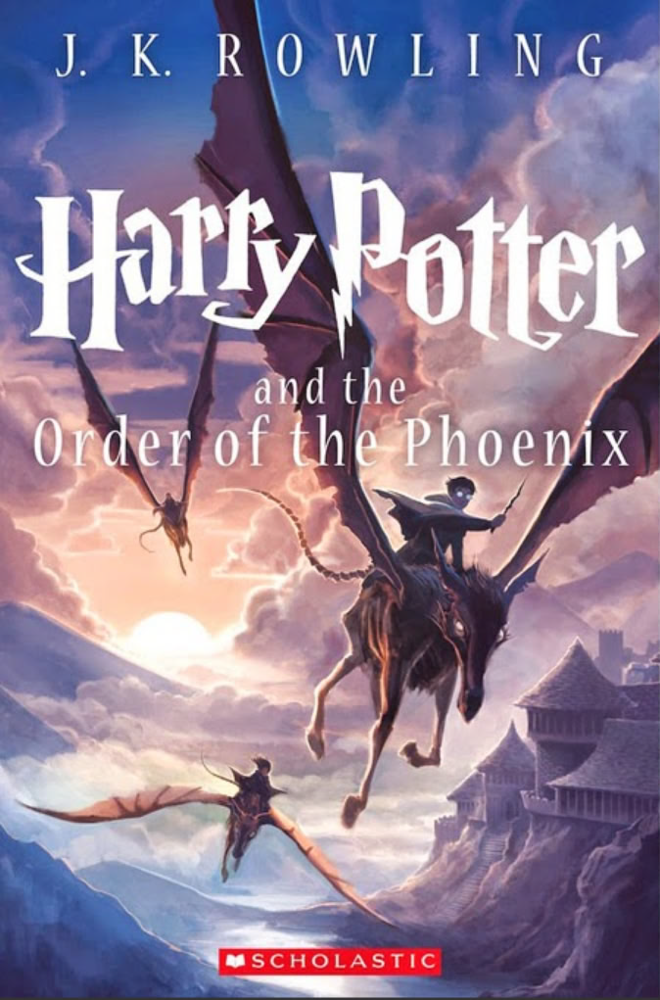

# 📖 AI-Generated Book Cover: Harry Potter (Alternative Edition)

## 📘 Original Work
Original book: *Harry Potter and the Order of the Phoenix* by J.K. Rowling.


Official covers often depict Harry and his friends flying on thestrals across dramatic skies with a view of Hogwarts in the distance.

## ✨ AI-Generated Variation
This version presents a magical illustrated interpretation of a young wizard flying on a skeletal-winged thestral over Hogwarts at sunset. Inspired by children’s fantasy art with painterly textures and a warm enchanted tone.


Image was generated locally with a self-hosted Stable Diffusion setup via **ComfyUI**, using a GPU-powered pipeline on **Fedora Linux 40** and **RTX 4060**.

---

## ⚙️ Workflow Details

### 🧩 Model Used:
- **Name:** Realistic Vision v5.1  
- **Format:** `.safetensors`

### 🔌 Extensions / LoRA:
- None used

### 🧪 Generation Parameters:
- **Steps:** 30  
- **CFG Scale:** 7.0  
- **Sampler:** `dpmpp_2m_sde_gpu`  
- **Scheduler:** `normal`  
- **Seed:** 994371700060017  
- **Denoise Strength:** 1.0  
- **Resolution:** 768 x 1024  
- **Batch size:** 1

---

## 💬 Prompt:
```text
fantasy illustrated book cover of a young wizard flying on a skeletal winged horse-like creature (thestral), dramatic sunset sky with glowing clouds, magical castle in the distance, epic flying pose, cinematic composition, children’s fantasy art, soft painterly illustration, book cover
```

## ❌ Negative Prompt:
```text
extra limbs, deformed, blurry, bad anatomy, distorted face, low quality, grotesque, malformed wings, glitchy
```

## 🖥️ Tools & Hardware:
Interface: ComfyUI (local)

OS: Fedora Linux 40

GPU: NVIDIA RTX 4060

Image Generator: Stable Diffusion (self-hosted)

## 🧩 Screenshot of the Pipeline
