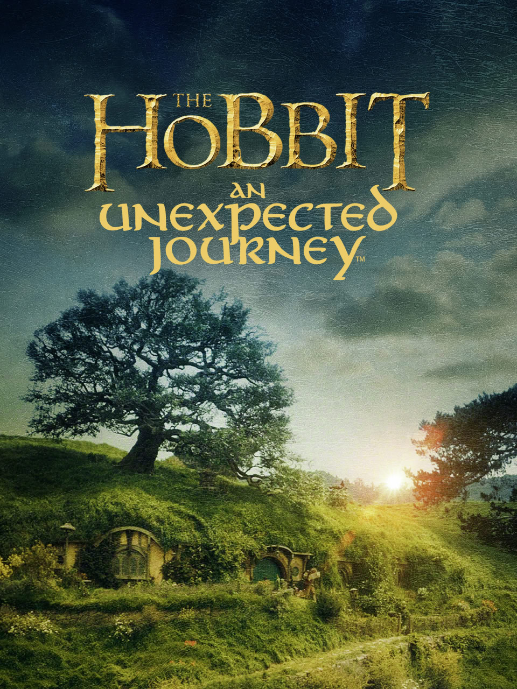
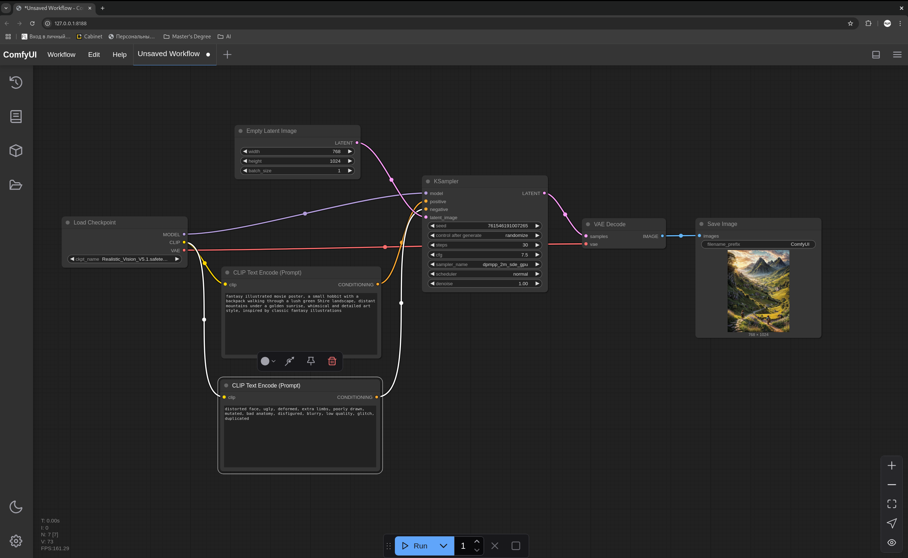

# 🎬 AI-Generated Movie Poster: The Hobbit — An Unexpected Journey (Alternative Edition)

## 🎞️ Original Work
Original movie: *The Hobbit: An Unexpected Journey* (2012), directed by Peter Jackson.


Classic posters depict Bilbo Baggins standing with Sting (his sword), or walking into the distance with mountains and the Shire behind him.

## 🎨 AI-Generated Variation
This AI-generated variation recreates the spirit of adventure from the original film through a stylized fantasy poster: a small hobbit walking through lush Shire hills toward distant mountains under a golden sky. Illustration style inspired by classic fantasy novels and book covers.


The image was generated with a fully local self-hosted **Stable Diffusion** setup via **ComfyUI**, running on **Fedora Linux 40** using **NVIDIA RTX 4060**.

---

## ⚙️ Workflow Details

### 🧩 Model Used:
- **Name:** Realistic Vision v5.1  
- **Format:** `.safetensors`

### 🔌 Extensions / LoRA:
- None used

### 🧪 Generation Parameters:
- **Steps:** 30  
- **CFG Scale:** 7.5  
- **Sampler:** `dpmpp_2m_sde_gpu`  
- **Scheduler:** `normal`  
- **Seed:** 765149181007205  
- **Denoise Strength:** 1.0  
- **Resolution:** 768 x 1024  
- **Batch size:** 1

---

## 💬 Prompt:
```text
fantasy illustrated movie poster, a small hobbit with a backpack walking through a lush green Shire landscape, distant mountains under a golden sunrise, whimsical and detailed art style, inspired by classic fantasy illustrations
```

## ❌ Negative Prompt:
```text
distorted face, ugly, deformed, extra limbs, poorly drawn, mutated, bad anatomy, disfigured, blurry, low quality, glitch, duplicated
```

## 🖥️ Tools & Hardware:
Interface: ComfyUI (local)

OS: Fedora Linux 40

GPU: NVIDIA RTX 4060

Image Generator: Stable Diffusion (self-hosted)

## 🧩 Screenshot of the Pipeline
